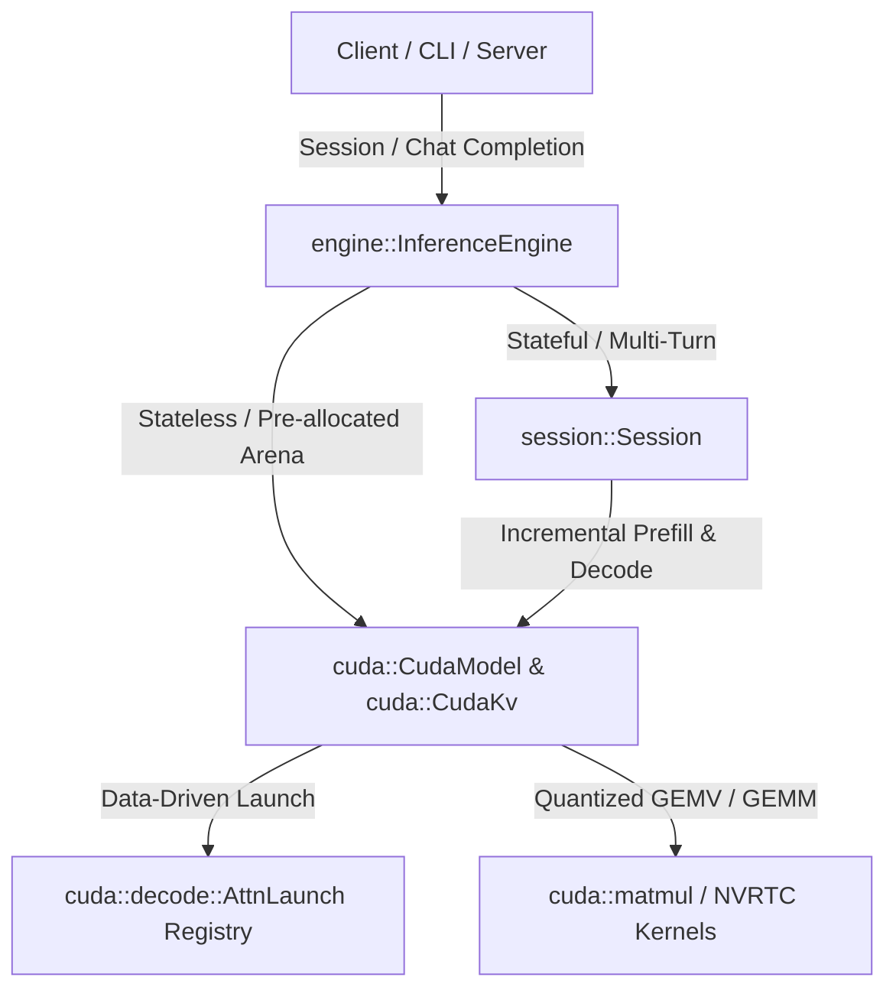

# Core Inference Engine Review (`crates/core`)

This document provides a deep-dive technical and architectural review of the **taraference** core inference engine located in [`crates/core`](file:///d:/taraference/crates/core). Specifically engineered for multi-turn **Qwen2.5 GGUF** inference on constrained hardware (specifically targeted and optimized for the **NVIDIA RTX 3050 Ti 4GB**), the engine demonstrates exceptional mechanical sympathy, zero-allocation runtime execution, and an elegant data-driven abstraction design.

---

## 1. Architectural Overview & Abstraction Layers

The core engine is cleanly partitioned into three primary tiers:



### Key Components:
- **[`InferenceEngine`](file:///d:/taraference/crates/core/src/engine.rs#L35)**: The top-level orchestrator. It loads the GGUF weights, initializes the tokenizer, compiles NVRTC device kernels, and allocates a single unified GPU workspace (`CudaModel`) and KV cache arena (`CudaKv`). It exposes two distinct execution paradigms:
  1. **Stateful (`session()`)**: Binds the pre-allocated `CudaKv` to a [`Session`](file:///d:/taraference/crates/core/src/session.rs#L83) for low-latency, interactive, multi-turn chat (`/run_repl`).
  2. **Stateless (`chat_completion()`)**: Clears and reuses the `CudaKv` buffer per request, serving as the backbone for the OpenAI-compatible HTTP endpoint (`/v1/chat/completions`).
- **[`Session`](file:///d:/taraference/crates/core/src/session.rs#L83)**: Manages prompt formatting using **ChatML** ([`format_chatml`](file:///d:/taraference/crates/core/src/chat.rs#L62)), tracks generation statistics ([`TurnStats`](file:///d:/taraference/crates/core/src/session.rs#L19)), handles streaming SSE/stdout callbacks, and manages append-only incremental multi-turn history.
- **[`CudaModel`](file:///d:/taraference/crates/core/src/cuda/model.rs#L10)**: Owns GPU weights, pre-allocated workspace slices, the single `CudaStream`, and the compiled CUDA kernel handles ([`Kernels`](file:///d:/taraference/crates/core/src/cuda/types.rs#L40)).

---

## 2. Memory Management & VRAM Efficiency (`CudaKv` & Workspaces)

Operating within a 4 GB VRAM budget while holding ~1.8 GiB of Q4 weights plus up to 5,000 context tokens requires strict VRAM conservation:

### 1. Half-Precision (`f16`) KV Cache
In [`CudaModel::alloc_kv`](file:///d:/taraference/crates/core/src/cuda/model.rs#L39) and [`CudaKv`](file:///d:/taraference/crates/core/src/cuda/kv.rs#L5), keys and values are stored as raw `u16` half-precision bit patterns across all layers:
$$\text{Memory per token} = 2 \times \text{layers} \times \text{stride} \times 2 \text{ bytes (K+V)}$$
For Qwen2.5-3B ($L=36, \text{heads}_{kv}=2, \text{head\_dim}=128$), each token consumes exactly **18.432 KiB** of KV cache. A full 5,000-token context requires only **~90 MiB** of VRAM for keys and values combined. This cuts both VRAM footprint and HBM attention bandwidth in half compared to `f32`.

### 2. Zero-Allocation Forward Loop
During initialization ([`CudaModel::load_with`](file:///d:/taraference/crates/core/src/cuda/load.rs#L158-L171)), all activations and intermediate buffers (`x`, `xb`, `q`, `k_buf`, `v_buf`, `hb`, `hb2`, `logits`, `argmax_buf`) are pre-allocated for the maximum batch chunk (`MAX_BATCH = 256`). Once loaded, **zero GPU memory allocations or deallocations occur during token generation**, completely eliminating CUDA memory allocator overhead and memory fragmentation.

---

## 3. Dynamic NVRTC Compilation & Kernel Registry

Instead of bundling pre-compiled `.ptx` files or requiring external toolchains at build time, the engine compiles CUDA C fragments at startup via `cudarc::nvrtc`:

### 1. Runtime Compilation (`cuda/load.rs`)
In [`CudaModel::load_with`](file:///d:/taraference/crates/core/src/cuda/load.rs#L59-L74), NVRTC compiles raw device source (`SOURCE`) with highly optimized flags:
- `arch: Some("sm_86")` (targeted specifically at Ampere / RTX 30xx features)
- `ftz: true`, `prec_div: false`, `fmad: true`, `use_fast_math: true` (ensuring peak arithmetic throughput for half/float math).

### 2. Data-Driven Attention Registry (`decode.rs`)
A standout architectural achievement is the **Pluggable Attention Registry** ([`REGISTRY`](file:///d:/taraference/crates/core/src/cuda/decode.rs#L86-L131)):
- Each backend (`fast`, `fastv2`, `basic`, `online`) is declared as a [`DecodeSpec`](file:///d:/taraference/crates/core/src/cuda/decode.rs#L68) specifying its launch shape (`AttnLaunch`) and shared memory scaling rule ([`SmemRule`](file:///d:/taraference/crates/core/src/cuda/decode.rs#L24)).
- Adding a new experimental attention kernel (`fast_v3.cu`) requires only appending a single struct entry to `REGISTRY` and placing the kernel file in `kernels/attn/`.
- The transformer forward pass in [`layer.rs`](file:///d:/taraference/crates/core/src/cuda/layer.rs#L338-L415) (`launch_attn_spec`) dynamically dispatches the right grid/block/smem configurations without requiring conditional `match` arms for specific backends.

---

## 4. Attention Backends & `fastv2` Deep Dive

The engine provides four selectable `--decode` attention backends:

| Backend | Smem Rule | Characteristics |
| :--- | :--- | :--- |
| **`fastv2`** (Default) | `(head_dim + 64) * 4` | Tiled online softmax with fixed shared memory. Prevents shared memory overflow at large sequence lengths. |
| `fast` (`v1`) | `(head_dim + seq_len) * 4` | Parallel softmax where `scores[seq_len]` are held in shared memory. Limited by max shared memory per block (~48–64 KB). |
| `online` | `head_dim * 2 * 4` | Single-token online reduction (`attn_online_f32`) with automatic prefill fallback to `fastv2`. |
| `basic` | `seq_len * 4` | Baseline serial reduction for benchmarking comparisons. |

### Why `fastv2` (`attn_fast_v2`) Excels:
In [`fast_v2.cu`](file:///d:/taraference/crates/core/src/cuda/kernels/attn/fast_v2.cu#L45-L90), the kernel iterates over the context in blocks of `ATTN_TILE = 64`. It maintains running maximum (`m`) and running denominator (`l`) accumulators across tiles:
$$\alpha = \exp(m_{\text{old}} - m_{\text{new}})$$
$$\text{acc}_{\text{new}} = \text{acc}_{\text{old}} \cdot \alpha + \sum_{t \in \text{tile}} \exp(\text{score}_t - m_{\text{new}}) \cdot V_t$$
Because only `ATTN_TILE = 64` scores are buffered in shared memory at any moment, **shared memory requirements remain constant regardless of sequence length ($N \le 5000$)**, guaranteeing stable high-speed execution across long multi-turn sessions.

---

## 5. Execution Optimization: Chunked Prefill & Fused GEMV

### 1. Chunked Prefill (`forward_chunk`)
To handle long prompts without exceeding `MAX_BATCH` (256 tokens) or causing GPU watchdog timeouts (TDR), [`CudaModel::forward_greedy`](file:///d:/taraference/crates/core/src/cuda/forward.rs#L20-L28) processes tokens in chunks of $\le 256$:
- When `n_tok > 1`, [`gemm`](file:///d:/taraference/crates/core/src/cuda/matmul.rs#L94) (`gemm_q4_k`, `gemm_q6_k`, etc.) is launched across columns to exploit parallel matrix-matrix multiplication.
- When `n_tok == 1` (the auto-regressive decoding phase), [`gemv`](file:///d:/taraference/crates/core/src/cuda/matmul.rs#L42) is used, utilizing 8 warps per block (`GEMV_WARPS = 8`) to compute 8 output columns simultaneously with input vector staging in shared memory (`xs[]`).

### 2. Fused Residual & Bias Operations (`GemvResidual::InPlace`)
A major kernel-launch optimization during decoding (`n_tok == 1`) is the fusion of bias and residual additions directly into the GEMV kernel ([`gemv.cu`](file:///d:/taraference/crates/core/src/cuda/kernels/gemv.cu#L75-L81)):
```c
if (lane == 0) {
    acc = gemv_apply_res(use_res, acc, out, j, residual); // out[j] += dot
    if (use_bias) acc += bias[j];
    out[j] = acc;
}
```
In [`layer.rs`](file:///d:/taraference/crates/core/src/cuda/layer.rs#L207-L215), `wo` (attention output) and `down` (MLP output) pass `GemvResidual::InPlace`. This directly updates `x[j] += dot` in single-token decoding, **saving 3 standalone CUDA kernel launches per transformer layer** (2 residual additions + 1 bias addition), which dramatically reduces CPU launch latency bound during token generation.

---

## 6. Strengths, Trade-Offs & Actionable Recommendations

### Key Strengths
1. **Mechanical Sympathy for Constrained Hardware**: Perfectly tuned memory layouts (`f16` KV, Q4_K_M/Q5_0 GEMV kernels) and fused residuals allow Qwen2.5-3B to run interactively on a 4 GB RTX 3050 Ti without swapping.
2. **Extensibility via Registry**: The data-driven `DecodeBackend` registry makes benchmarking and testing new CUDA attention kernels clean, isolated, and safe from regressions.
3. **Robust Separation of Concerns**: The CLI, OpenAI HTTP server, and profiling framework all share exact identical core primitives (`InferenceEngine` + `Session`), ensuring consistency in token statistics (`TurnStats`) and chat templates across interfaces.

### Identified Trade-Offs & Recommendations for Future Growth

| Area | Current Implementation | Trade-off / Limitation | Actionable Recommendation |
| :--- | :--- | :--- | :--- |
| **Decoding Strategy** | Greedy next-token argmax (`argmax_f32` in [`layer.rs`](file:///d:/taraference/crates/core/src/cuda/layer.rs#L463-L474)). | No support for non-deterministic sampling (Temperature, Top-$K$, Top-$P$, Repetition Penalty). | Create a `Sampler` struct in `engine.rs` that accepts sampling parameters. After `copy_last`, either perform top-$K$/temperature sampling via a small GPU reduction kernel or copy the top $N$ logits to host memory for CPU-side sampling. |
| **GPU Arch Targeting** | Static `arch: Some("sm_86")` hardcoded in [`load.rs`](file:///d:/taraference/crates/core/src/cuda/load.rs#L62). | Fails to optimize for newer architectures (`sm_89` Ada Lovelace, `sm_90` Hopper) or older ones (`sm_75` Turing) without code changes. | Query `CudaContext::get_device_attribute` at runtime (`CU_DEVICE_ATTRIBUTE_COMPUTE_CAPABILITY_MAJOR/MINOR`) to dynamically format the `sm_XX` string passed to `cudarc::nvrtc::CompileOptions`. |
| **Concurrency / Batching** | Single `InferenceEngine` per process/stream (`Arc<CudaStream>`), single KV arena. | Requests on `/v1/chat/completions` are serialized one-by-one. No continuous batching across distinct users/sessions. | For high-throughput server workloads, separate `CudaKv` into paged slots (PagedAttention style) and extend `forward_chunk` to process multi-sequence batches (`blockIdx.z` or batched GEMV/GEMM). |
| **Context Length Scaling** | Max sequence capped at `max_seq` (default 5,000) during initial KV buffer allocation. | Cannot dynamically extend beyond `max_seq` during an active session without hitting `context full` error. | Implement sliding-window attention eviction or RoPE context extension techniques (e.g., YaRN or dynamic scaling) when `cache.len + tokens.len() > cache.max_seq`. |

---

## Summary
The **taraference** core inference engine is a masterclass in clean, focused Rust/CUDA systems engineering. By eliminating dynamic memory allocation, utilizing tiled online attention (`fastv2`), compressing KV history to `f16`, and fusing residual stream updates into quantized GEMV kernels, it squeezes maximum performance from consumer GPU hardware while maintaining an elegant, extensible architecture.
